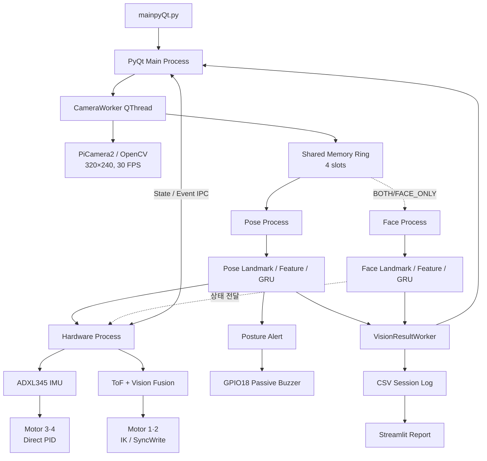
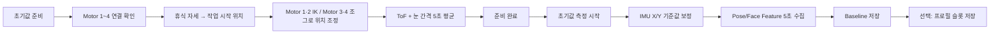

<p align="center">
  
</p>

# POCO (Vision Pose Coach)

> 비전 AI 자세 판단과 4축 모니터암 자동 추종을 결합한 Raspberry Pi 기반 자세 코칭 시스템

POCO는 카메라 영상에서 사용자의 자세를 실시간으로 분류하고, 잘못된 자세가 지속되면 부저로 교정을 유도하며, 측정 기록을 일일 리포트로 보여주는 시스템입니다.

현재 버전은 기존의 Pose/Face 기반 자세·피로도 분석 구조에 다음 모니터암 기능을 통합했습니다.

- ToF 거리와 Pose 눈 간격을 결합한 사용자 위치 추정
- Motor 1·2의 2-Link IK 기반 전후 자동 추종
- ADXL345 IMU와 Motor 3·4를 이용한 모니터 수평 유지
- 사용자 미검출, 낮은 자세 신뢰도, 비정상 자세에 대한 모터 안전 정지
- 초기 준비, 사용자별 보정 프로필, 측정 종료 후 휴식 자세 복귀

> [!IMPORTANT]
> 현재 기본 실행 모드는 `POSE_ONLY`입니다. 자세 판단과 모니터암 제어는 활성화되며, Face 피로도 Process는 실행되지 않습니다. 자세와 피로도를 함께 사용하려면 `WorkSpace/pyQt/managers/vision_process_manager_profile.py`의 `PROFILE_MODE`를 `BOTH`로 변경하고 Face 기준값까지 보정해야 합니다.

## 주요 기능

| 영역 | 기능 |
|---|---|
| 자세 인식 | MediaPipe Pose 랜드마크와 TFLite GRU를 이용해 `Optimal`, `Asymmetric`, `Forward Head`, `Chin Propping` 분류 |
| 피로도 인식 | MediaPipe Face 랜드마크와 TFLite GRU를 이용해 `Normal`, `Drowsy` 분류 (`BOTH`/`FACE_ONLY` 모드) |
| 개인화 보정 | 사용자 기준 자세, ToF·눈 간격, IMU 기준값, 모터 시작 각도를 함께 저장 |
| 사용자 프로필 | 최대 4개 슬롯에 보정 묶음을 저장하고 다음 실행에서 다시 적용 |
| 모니터암 추종 | ToF 70% + Vision 30%로 사용자 X 위치를 추정하고 Motor 1·2를 동시 제어 |
| 수평 유지 | IMU X/Y 오차를 PID로 보정해 Motor 3·4 짐벌 제어 |
| 자세 알림 | 나쁜 자세의 유지 시간, 반복 횟수, Strong Alert, Cooldown을 적용해 GPIO18 부저 구동 |
| 안전 제어 | ToF/랜드마크 유실, 비정상 자세, 낮은 신뢰도에서 자동 추종 중지; 5초 미검출 시 초기 작업 자세 복귀 |
| 측정 기록 | 측정 결과를 날짜별 CSV로 누적 저장 |
| 일일 리포트 | Streamlit과 Plotly로 자세 시간, 빈도, 점수와 피드백 시각화 |

## `mainpyQt.py` 실행 흐름

### 전체 구조



카메라는 Main Process의 `CameraWorker`가 한 번만 읽습니다. 활성화된 Pose/Face Process는 동일 프레임을 각자의 Shared Memory Ring에서 읽으므로, 카메라 장치를 여러 Process가 중복 점유하지 않습니다.

실시간 랜드마크·센서처럼 최신값만 필요한 데이터는 크기 1의 State Queue로 전달하고, 시작/종료/보정 완료/ACK처럼 유실되면 안 되는 명령은 순서를 보장하는 Event Queue로 분리합니다.

### 1. 프로그램 시작

```text
python WorkSpace/pyQt/mainpyQt.py
  → QApplication 생성
  → pocoApplication_Qss.ui 로드
  → 알림 설정과 하드웨어 설정 JSON 로드
  → 사용자 프로필 슬롯 확인
  → PyQt 이벤트 루프 시작
```

처음 창이 열릴 때는 카메라, AI Process, Hardware Process를 바로 생성하지 않습니다. 사용자가 `초기값 준비`, `프로필`, `수동조작` 중 하나를 선택할 때 `CameraWorker`가 생성되며 다음 자원이 시작됩니다.

- Linux: PiCamera2를 우선 사용하고 실패하면 OpenCV 카메라로 전환
- Windows/기타 환경: OpenCV 기본 카메라 사용
- `HardwareProcess`: IMU, ToF, Motor 1~4, 부저 초기화
- `PoseProcess`: 기본 모드에서 MediaPipe Pose 초기화
- `FaceProcess`: `BOTH` 또는 `FACE_ONLY`일 때만 초기화
- `VisionResultWorker`: Process 결과와 하드웨어 State/Event를 PyQt Signal로 전달

카메라는 30 FPS로 읽고, GUI 영상은 15 FPS로 갱신합니다. AI 모델과 Scaler는 앱 시작 시가 아니라 실제 측정을 시작할 때 지연 로딩합니다.

### 2. 새 사용자 초기값 설정

새 보정은 반드시 아래 순서로 진행합니다.



#### 2-1. 모니터암 초기 준비

`초기값 준비` 버튼은 카메라 프리뷰와 Pose 눈 랜드마크 처리를 켜고 모니터암 준비 창을 엽니다.

1. Servo 1~4 연결, Ping, Calibration 정보를 확인합니다.
2. Motor 1·2를 휴식 자세에서 작업 시작 위치로 안전하게 이동합니다.
3. 필요하면 사용자 X, 사용자-모니터 고정거리, 모니터 높이를 입력해 IK 위치를 조정합니다.
4. Motor 3·4를 조그 방식으로 움직여 모니터 수평을 맞춥니다.
5. ToF 사용자 거리와 MediaPipe 눈 간격을 5초간 평균 측정합니다.
6. Motor 준비, 작업 위치 도착, 센서 평균 저장이 모두 완료되어야 준비 창을 종료할 수 있습니다.

이 단계에서 저장되는 모니터암 보정값은 `WorkSpace/data/settings/monitor_arm_user_calibration.json`에 기록됩니다.

#### 2-2. IMU와 Vision 기준값 측정

`초기값 측정시작` 버튼을 누르면 먼저 Hardware Process가 ADXL345의 X/Y 기준값을 측정합니다. IMU와 Motor 1~4, 모니터암 준비값이 모두 유효하다는 ACK를 받은 뒤에만 Pose/Face 기준 자세 수집이 시작됩니다.

- Pose 기준값: `WorkSpace/saved_model/baseline.pkl`
- Face 기준값: `WorkSpace/saved_model/baseline_face.pkl`
- 기준값 수집 시간: 유효 Feature가 처음 들어온 시점부터 5초
- 유효 샘플이 부족하면 기존 정상 baseline을 덮어쓰지 않음

보정이 끝나면 현재 기준값을 4개의 사용자 프로필 슬롯 중 하나에 저장할 수 있습니다. 프로필에는 Vision baseline뿐 아니라 ToF·눈 간격, IMU 기준값, Motor 1~4 시작 각도가 함께 저장됩니다.

### 3. 기존 사용자 프로필 불러오기

`프로필` 버튼에서 저장된 슬롯을 고르면 다음 항목을 한 번에 복원합니다.

```text
Pose/Face baseline
  + ToF·눈 간격 기준값
  + IMU X/Y 기준값
  + Motor 1~4 작업 시작 기준 각도
  → Hardware Process APPLY_USER_PROFILE
  → USER_PROFILE_APPLIED ACK
  → 측정 시작 버튼 활성화
```

프로필 데이터는 `WorkSpace/data/user_profiles/slot_1`부터 `slot_4`까지 저장됩니다. 프로필 적용은 저장된 모터 각도를 기준 정보로 복원하며, 불러오는 순간 모터를 그 각도로 자동 이동시키지는 않습니다.

### 4. 실시간 측정

`측정 시작` 버튼을 누르면 다음 조건을 먼저 검사합니다.

- 현재 모드에 필요한 Pose/Face baseline 존재
- IMU가 현재 세션에서 보정되었고 사용 가능함
- Motor 1~4가 연결·활성·준비 상태임
- Pose 모드에서는 ToF·눈 간격 세션 보정값이 준비됨

검사를 통과하면 Pose/Face Process가 baseline, Scaler, TFLite GRU 모델을 로드합니다. 모든 활성 Process의 시작 ACK가 도착한 후에만 Shared Memory 프레임 공급을 재개합니다. 모델 로딩 중 Ring이 가득 차는 것을 막기 위한 절차입니다.

#### 자세·피로도 판단

```text
카메라 프레임
  → MediaPipe Landmark
  → Pose 10개 / Face 4개 Feature
  → 사용자 baseline 차감
  → 최근 30프레임 GRU Window
  → 5프레임마다 TFLite 추론
```

현재 기본 `POSE_ONLY` 모드의 자세 라벨은 다음과 같습니다.

| Index | Label | 의미 |
|---:|---|---|
| 0 | `Optimal` | 정상 자세 |
| 1 | `Asymmetric` | 좌우 비대칭 |
| 2 | `Forward Head` | 거북목/머리 전방 자세 |
| 3 | `Chin Propping` | 턱 괴기 |

`BOTH` 모드에서는 Pose와 Face의 가장 최근 결과를 결합하되, 두 결과의 시간 차이가 1초를 넘으면 오래된 값을 섞지 않습니다.

#### 모니터암 자동 추종

Motor 1·2의 사용자 X 위치는 다음 방식으로 계산합니다.

```text
ToF user X = 센서 원점 + 필터링된 ToF 거리
Vision 거리 = 보정 거리 × 보정 눈 간격 / 현재 눈 간격
Vision user X = 현재 모니터 X + Vision 거리

Fused user X = 0.7 × ToF user X + 0.3 × Vision user X
목표 Monitor X = Fused user X - 사용자·모니터 목표 거리
```

- ToF와 Vision 모두 유효: 70:30 융합
- 눈 랜드마크가 유실됨: ToF 단독 사용
- ToF가 유실되거나 범위를 벗어남: Vision 단독 구동 금지, `SAFE_HOLD`
- Motor 1·2: 목표 Monitor X와 높이로 IK 계산 후 SyncWrite 동시 이동
- Motor 3·4: IMU Y/X 오차를 각각 Direct PID로 보정

자동 추종은 `MEASURING` 상태이면서 사용자가 감지되고, 최신 Pose 결과가 `Optimal`이며 신뢰도 조건을 만족할 때만 허용됩니다. 비정상 자세에서는 모니터암이 자세를 따라가며 나쁜 자세를 고착시키지 않도록 `POSTURE_HOLD` 상태가 됩니다.

#### 자세 알림과 기록

비정상 자세가 설정된 시간 이상 유지되면 Hardware Process의 `PostureAlertService`가 알림을 생성하고, `BuzzerService`가 GPIO18의 수동 부저 패턴을 비동기로 실행합니다. 반복 경고가 설정 횟수에 도달하면 Strong Alert로 승격되고 해당 자세에 Cooldown이 적용됩니다.

측정 결과는 약 0.5초 간격으로 UI에 반영되며 날짜별 CSV에 누적됩니다.

```text
WorkSpace/data/session_log/posture_log_YYYY-MM-DD.csv
```

UI에는 현재 자세, 신뢰도, 피로도, 경과 시간, 불안정 자세 TOP 3가 표시됩니다.

### 5. 측정 종료와 앱 종료

`카메라 끄기`를 누르면 추론을 먼저 중지하고 다음 종료 자세 이동을 요청합니다.

```text
Motor 1·2 → 휴식 자세
Motor 3·4 → 저장된 센서 중립각
  → 실제 각도 도착 확인(허용 오차 2°)
  → ACK 수신 또는 12초 timeout
  → 카메라 QThread만 종료
```

카메라를 꺼도 Vision/Hardware Process와 IPC 자원은 앱 안에서 유지하므로 다음 실행에서 재사용할 수 있습니다. 창 자체를 닫을 때는 카메라, Result Worker, Pose/Face/Hardware Process, Shared Memory, I2C/Serial/GPIO 자원을 모두 정리합니다.

### 6. 일일 리포트

`리포트` 버튼을 누르면 현재 Python 환경으로 다음 서버를 실행합니다.

```bash
python -m streamlit run WorkSpace/streamlit/app.py \
  --server.headless=true \
  --server.port=8501
```

Linux에서는 Chromium 키오스크 창, Windows에서는 Chrome/Edge 앱 창을 우선 사용합니다. 이미 서버가 실행 중이면 새 서버를 만들지 않고 브라우저만 다시 엽니다.

## 하드웨어 구성

| 장치 | 현재 기본 설정 | 역할 |
|---|---|---|
| Raspberry Pi 5 | Python 3.11 / Raspberry Pi OS | 전체 애플리케이션 실행 |
| Camera | PiCamera2 우선, OpenCV fallback | Pose/Face 영상 입력 |
| VL53L0X (HW-843) | I2C-3, `0x29`, BCM22/23 | 사용자 거리 측정 |
| ADXL345 | I2C-1, `0x53` | 모니터 기울기 X/Y 측정 |
| STS3215 Servo ×4 | `/dev/ttyACM0`, 1 Mbps, ID 1~4 | 모니터암과 짐벌 구동 |
| Passive Buzzer | BCM18, 2 kHz PWM | 자세 경고 출력 |

Servo 역할은 다음과 같습니다.

| ID | Joint | 제어 |
|---:|---|---|
| 1 | `shoulder_lift` | 사용자 X 추종 IK |
| 2 | `elbow_flex` | 사용자 X 추종 IK |
| 3 | `wrist_flex` | IMU Y Direct PID |
| 4 | `wrist_roll` | IMU X Direct PID |

> [!CAUTION]
> Motor 1·2는 실제 모니터 무게를 지지하므로 주변 충돌물을 제거하고 팔과 모니터를 지지할 준비가 된 상태에서 초기 이동을 수행해야 합니다. 약 15Ω으로 측정된 수동 부저도 Raspberry Pi GPIO에 직접 연결하지 말고 NPN 구동 회로를 사용해야 합니다.

### ToF I2C-3 활성화

`/boot/firmware/config.txt`에 다음 한 줄을 추가한 뒤 재부팅합니다.

```text
dtoverlay=i2c3-pi5,pins_22_23
```

```bash
sudo apt install -y i2c-tools
sudo reboot
i2cdetect -y 3
```

정상 연결이면 `0x29` 주소가 표시됩니다. 자세한 배선과 확인 방법은 `WorkSpace/hardware/BH_CODE/TOF_HW843_SETUP.md`를 참고하세요.

## 설치 및 실행

### Raspberry Pi 5 권장 설치

```bash
git clone https://github.com/EmbeddedVisionPoseCoach/POCO.git
cd POCO

git lfs install
git lfs pull

bash scripts/setup_pi.sh
source .venv/bin/activate

pip install adafruit-circuitpython-vl53l0x adafruit-extended-bus smbus2 gpiozero
python WorkSpace/pyQt/mainpyQt.py
```

`setup_pi.sh`는 Raspberry Pi OS의 시스템 PyQt/PiCamera 패키지를 활용하기 위해 `--system-site-packages` 방식의 `.venv`를 구성합니다. 모델, Scaler, MediaPipe Task 파일은 다음 경로에 있어야 합니다.

```text
WorkSpace/saved_model/
WorkSpace/tasks/
```

> [!NOTE]
> `WorkSpace/pyQt/start_pyqt.sh`에는 특정 장비의 절대 경로가 들어 있으므로 다른 설치 경로에서는 값을 수정하거나 위의 Python 직접 실행 명령을 사용하세요.

### Windows 개발 환경

Windows에서는 `requirements-win.txt`로 UI, 카메라, Vision 기능을 확인할 수 있습니다.

```powershell
py -3.11 -m venv .venv
.venv\Scripts\activate
pip install -r requirements-win.txt
python WorkSpace\pyQt\mainpyQt.py
```

Raspberry Pi 전용 I2C, GPIO, Servo 장치가 없으면 하드웨어는 준비 실패 상태가 되므로 전체 측정 절차 대신 UI/Vision 개발과 비실물 테스트 용도로 사용하세요.

## 주요 설정

| 파일 | 내용 |
|---|---|
| `WorkSpace/pyQt/managers/vision_process_manager_profile.py` | `PROFILE_MODE`: `POSE_ONLY`, `FACE_ONLY`, `BOTH` |
| `WorkSpace/modules/config.py` | 해상도, 모델 경로, 보정 시간, GRU Window/Stride, 라벨 |
| `WorkSpace/config/monitor_arm_settings.json` | 링크 형상, 목표 거리, ToF/Vision 융합, IK 속도, 휴식 자세, Safety 정책 |
| `WorkSpace/hardware/servo_calibration_result.json` | Servo ID, Zero, 방향, 안전 각도, Serial 장치 |
| `WorkSpace/data/settings/hardware_control.json` | IMU LPF/Deadband, PID, Motor 3·4 Runtime 튜닝 |
| `WorkSpace/data/settings/alarm_settings.json` | 자세 유지 시간, 부저 횟수, Strong Alert, Cooldown |

실행 중 알림 설정은 PyQt에서 저장하면 JSON 기록과 Hardware Process Runtime에 동시에 반영됩니다. 실시간 센서값은 SD 카드에 반복 기록하지 않고 `HARDWARE_STATE`와 Main Process의 메모리 Store에만 유지합니다.

## 프로젝트 구조

```text
POCO/
├── README.md
├── requirements.txt
├── requirements-win.txt
├── scripts/
│   └── setup_pi.sh
└── WorkSpace/
    ├── pyQt/
    │   ├── mainpyQt.py                       # PyQt 진입점과 사용자 흐름
    │   ├── camera_worker_profile_all.py      # 카메라 QThread / 프레임 공급
    │   ├── result_worker.py                  # 결과 통합 / UI / CSV 전달
    │   ├── monitor_arm_preparation_dialog.py # 초기 준비·수동 제어 UI
    │   ├── user_profile_dialog.py            # 4슬롯 프로필 UI
    │   ├── managers/
    │   │   └── vision_process_manager_profile.py
    │   ├── processes/
    │   │   ├── pose_process_profile.py
    │   │   ├── face_process_profile.py
    │   │   └── hardware_process.py
    │   ├── services/                         # 보정, GRU, 센서, 모터, 안전, 알림
    │   ├── ipc/                              # Queue와 Shared Memory Ring
    │   └── ui/                               # Qt Designer UI
    ├── modules/                              # 공통 설정, Feature, Logger
    ├── hardware/
    │   ├── motor_control/                    # STS3215 Driver/Controller
    │   └── servo_calibration_result.json
    ├── config/
    │   └── monitor_arm_settings.json
    ├── saved_model/                          # TFLite 모델, Scaler, Baseline
    ├── tasks/                                # MediaPipe Landmarker Task
    ├── data/
    │   ├── settings/
    │   ├── session_log/
    │   └── user_profiles/
    └── streamlit/                            # 일일 리포트 앱과 전처리
```

## 테스트

Raspberry Pi 실물 없이 모니터암 계산과 주요 상태 머신을 검사할 수 있습니다.

```bash
source .venv/bin/activate

python WorkSpace/pyQt/hardware_logic_selftest.py
python WorkSpace/pyQt/test_user_profile_and_safety.py
```

실제 모터를 연결하기 전에는 Servo Calibration과 통신 상태를 별도 확인하세요. 하드웨어 상세 문서는 `WorkSpace/hardware/`와 `WorkSpace/pyQt/README_MONITOR_ARM_CODE_MERGE.md`에 있습니다.

## 팀원

| 조병현 | 신동민 | 이종현 | 최은비 |
|:---:|:---:|:---:|:---:|
| Pose 모델·튜닝 및 데이터 수집 | 리포트 웹 및 데이터 수집 | Face 모델·튜닝 및 데이터 수집 | 카메라 수평 제어, 부저·알림 및 데이터 수집 |

기존 [VisionPoseCoach README](https://github.com/VisionAITeamProject/VisionPoseCoach/blob/main/README.md)의 프로젝트 목표와 기능 구성을 계승하고, 현재 `mainpyQt.py`에서 실제로 실행되는 멀티프로세스 Vision·Hardware 통합 흐름을 기준으로 이 문서를 갱신했습니다.
